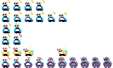
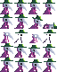
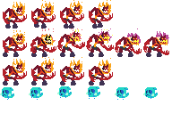
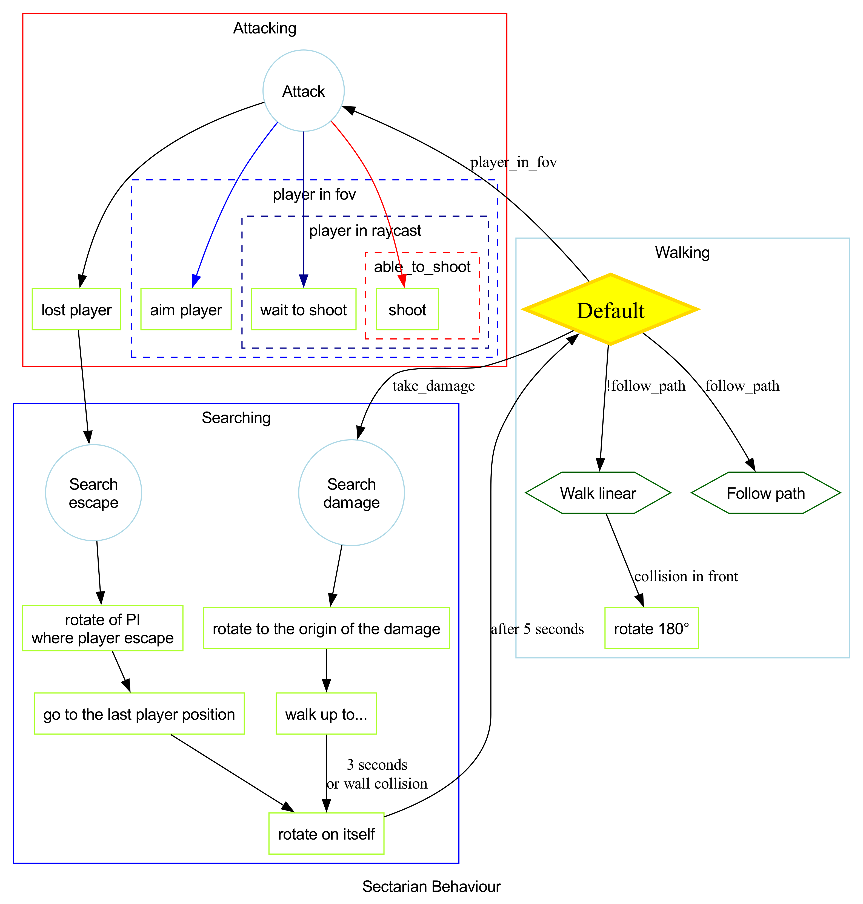
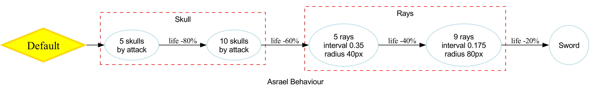

# TheShadowOfHeaven

## Summary

Its a 2D top-down shooter.
Player navigate through apocalyptic towers, battling demons and overcoming obstacles

## Game Character: Amos

It has several animations:

- Idle
- Move
- Attack
- Reload
- Dash (not implemented yet)

And it has a weapon that can be found and equipped:

- Sword (already equipped)
- Revolver
- Shotgun
- Divine Ray Gun

## Controls

| Actions                | Keyboard and Mouse | Controller             |
| ---------------------- | ------------------ | ---------------------- |
| Moving the character   | "WASD" inputs      | Left joystick          |
| Aiming                 | Mouse movement     | Right joystick         |
| Change weapon          | Scrolling, or "E"  | "X"                    |
| Reloading              | "R"                | "Y"                    |
| Dash                   | "SPACE BAR"        | Joystick left trigger  |
| Interaction            | "F"                | "A"                    |
| Attack (shot or melee) | Left mouse click   | Joystick right trigger |
| Pause                  | "ESC"              | "START"                |

## Gameplay

### Exploration

Can explore the map, find hidden paths, and secret rooms.

### Combat

Fight against enemies, using different weapons and strategies.

### Boss Fights

Defeat the final boss, Asrael, in a multi-phase combat.

## Game World

Divided into three sections
We discover a new weapon in each section.

### Castle of Greed

Find spikes

### Tower of Betrayal

Find self-closing doors

### Tower of Wrath

Find lava floors

## Enemies

The game's main enemies are sectarians, ghosts and demons, with a specific attack pattern.

### Sectarians

**Revolver Sectarian:**
Fires one bullet at a time
The player can dodge the bullet with his sword

### Demons

**Fireballs:** Direct projectiles
Damage when they hit the player
Dequiring to avoid them, can't be destroyed

## Final Boss: Asrael

In the final tower, the player faces Asrael, the fallen angel, in a multi-phase battle.

### Battle Phases:

1. **Clones:** Asrael creates clones that must be destroyed before he can be harmed, hiding in the last one struck.
2. **Evil Light Thrower:** He unleashes dark orbs in a spiral pattern, filling the arena with deadly projectiles.
3. **Magic Light Rays:** Asrael fires beams of energy across the battlefield. After each attack, he becomes briefly vulnerable, allowing the player to strike.

## Bonus Achievements

- **Angel’s Army:** Play in co-op mode with two or more players.
- **God’s Protection:** Complete the game without taking any damage.
- **No Mercy:** Defeat every single enemy from start to finish.
- **Angel Explorer:** Discover the secret room.
- **Cleaner:** Complete the game using only melee attacks.
